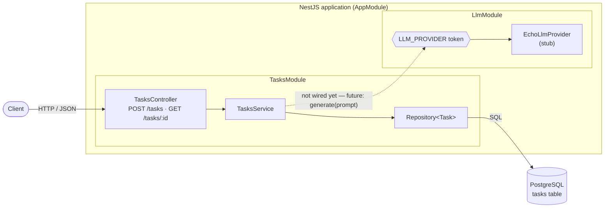
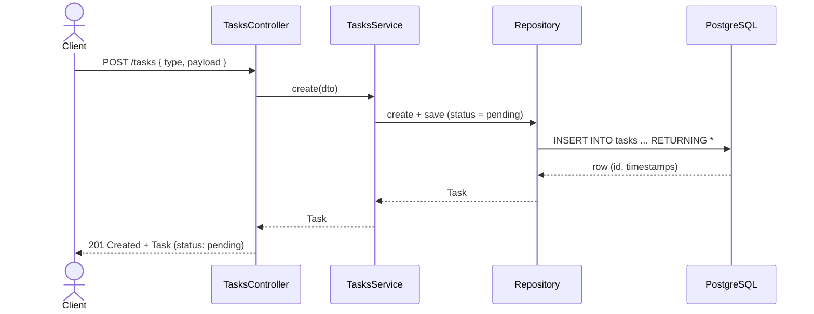
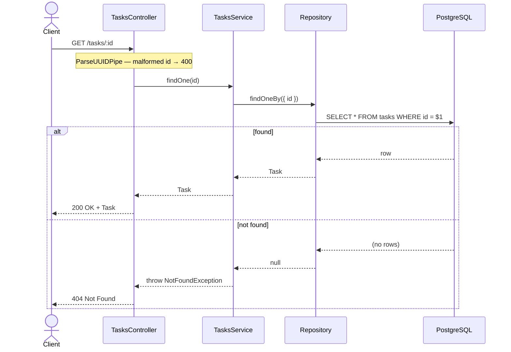
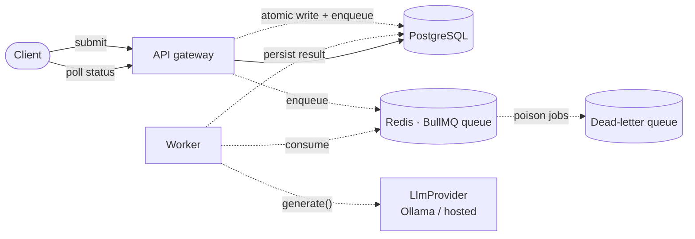

# Architecture

A living description of how the system is built. Updated as implementation
progresses — it always reflects the **current** state, with a clearly-labelled
sketch of where things are heading.

Point-in-time *decisions* (and why we made them) live in [`adr/`](adr/README.md);
this document shows the resulting structure and behaviour.

> Diagrams are [Mermaid](https://mermaid.js.org/) — they render on GitHub and
> diff as plain text. **Convention:** solid lines are implemented today; dashed
> lines are planned and not yet built.

## System overview — current

A single NestJS application accepts tasks over HTTP and persists them in
PostgreSQL via a TypeORM repository. The LLM provider seam exists but is not yet
consumed by task processing.

## Request flows — current

### Create a task — `POST /tasks`

### Fetch a task — `GET /tasks/:id`

`:id` is validated as a UUID first (`ParseUUIDPipe`), so a malformed id is
rejected with `400` before any lookup.

## Target architecture — planned

Where the system is heading: the slow LLM call moves off the request path, behind
a queue, into a separate worker that survives restarts. **None of the dashed
components exist yet** — they arrive as implementation progresses, each justified
by an ADR.

### How today maps onto the target

| Concern | Today | Target |
| --- | --- | --- |
| Task intake | `TasksController` | API gateway service |
| Storage | ✅ PostgreSQL (TypeORM) | PostgreSQL, shared by API + worker |
| LLM work | seam only (echo stub) | worker calls provider off the request path |
| Delivery | synchronous | queue + retries + dead-letter queue |
| Provider | `EchoLlmProvider` | Ollama (local) / hosted, same `LlmProvider` seam |

As each row's "Today" catches up to "Target", the diagrams above move from dashed
to solid and this table shrinks.
