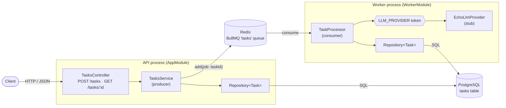
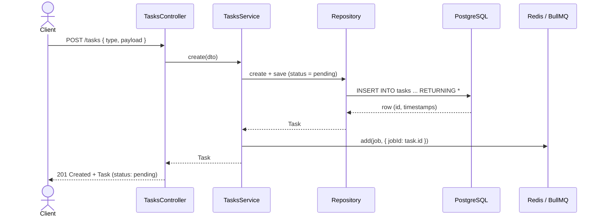
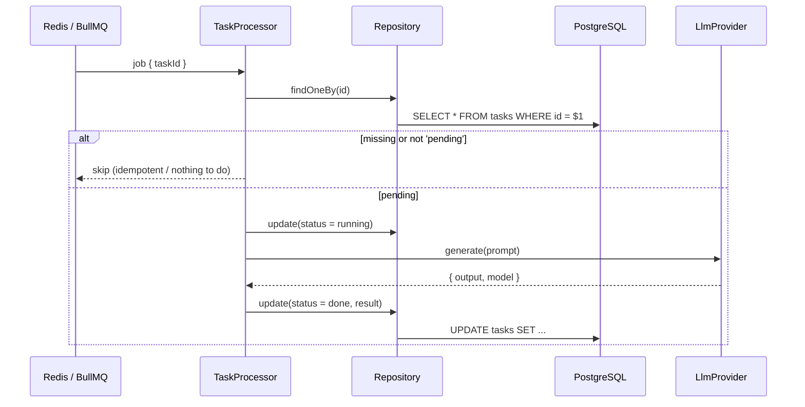
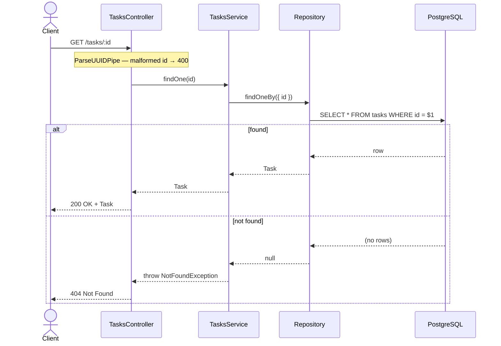
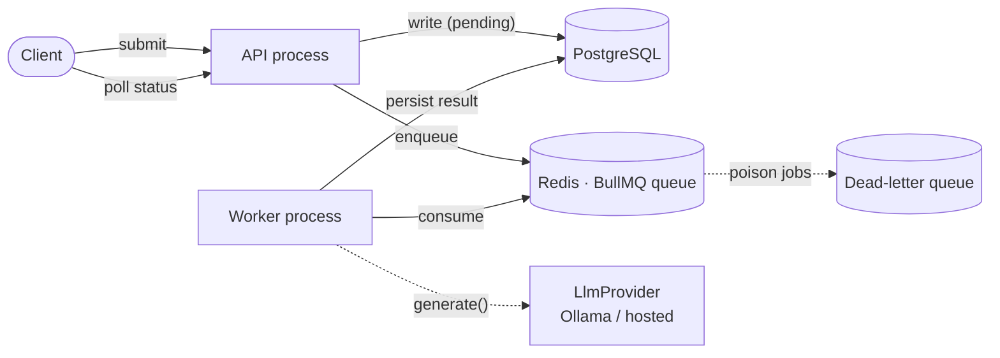

# Architecture

A living description of how the system is built. Updated as implementation
progresses — it always reflects the **current** state, with a clearly-labelled
sketch of where things are heading.

Point-in-time *decisions* (and why we made them) live in [`adr/`](adr/README.md);
this document shows the resulting structure and behaviour.

> Diagrams are [Mermaid](https://mermaid.js.org/) — they render on GitHub and
> diff as plain text. **Convention:** solid lines are implemented today; dashed
> lines are planned and not yet built.

## System overview — current

Two processes over one codebase share Postgres and Redis. The **API** (`main.ts`
→ `AppModule`) accepts tasks over HTTP, persists them as `pending`, and enqueues
a job — then returns immediately. The **worker** (`worker.ts` → `WorkerModule`)
consumes jobs off the BullMQ queue and runs them through the `LlmProvider`, off
the request path, writing the result back to Postgres. Killing the worker
doesn't stop intake: the API keeps queuing, and the worker drains the backlog
when it restarts (ADR-0007). The HTTP API is documented with OpenAPI/Swagger at
`/docs` (ADR-0006).

## Request flows — current

### Create a task — `POST /tasks`

The request returns as soon as the task is persisted and the job is queued; the
LLM call happens later, in the worker.

### Process a task — worker

Off the request path. A redelivered job whose task is no longer `pending` is
skipped (idempotency); a thrown error retries with backoff and only lands on
`failed` once attempts are exhausted.

### Fetch a task — `GET /tasks/:id`

`:id` is validated as a UUID first (`ParseUUIDPipe`), so a malformed id is
rejected with `400` before any lookup.

## Target architecture — planned

The queue + separate worker now exist (solid above). What remains dashed: an
explicit **dead-letter queue** for poison jobs, and swapping the echo stub for
real inference. They arrive as implementation progresses, each justified by an
ADR.

### How today maps onto the target

| Concern | Today | Target |
| --- | --- | --- |
| Task intake | ✅ `TasksController`, returns immediately | same, behind a gateway |
| Storage | ✅ PostgreSQL (TypeORM), shared by API + worker | same |
| LLM work | ✅ worker calls the provider off the request path | same, real model |
| Delivery | ✅ queue + retries (BullMQ); idempotent processing | + dead-letter queue for poison jobs |
| Provider | `EchoLlmProvider` (stub) | Ollama (local) / hosted, same `LlmProvider` seam |

As each row's "Today" catches up to "Target", the diagrams above move from dashed
to solid and this table shrinks.
